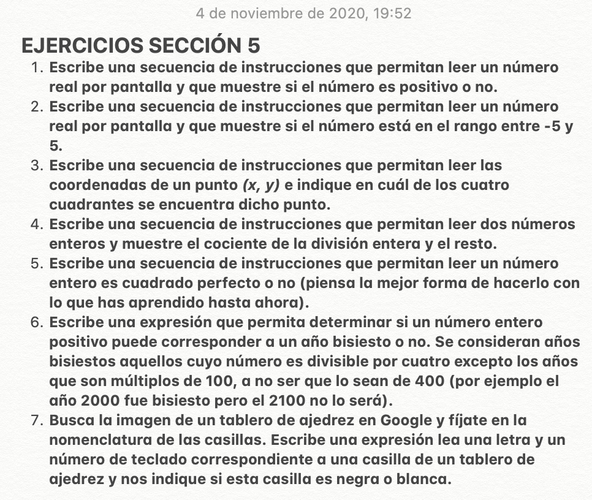

## INTRODUCCIÓN
**R Markdown:** Es un tipo de fichero en el cual podemos intercalar texto, código y fórmulas matemáticas.

*Recursos:* 

* [RMarkdown Cheat Sheet](https://rstudio.com/wp-content/uploads/2015/02/rmarkdown-cheatsheet.pdf)

* [Markdown Quick Reference](https://wordpress.com/support/markdown-quick-reference/). A esta web también se puede acceder directamente de RStudio desde la pestaña "Help>Markdown Quick Reference"

* [Data Science Cheat Sheet](https://github.com/FavioVazquez/ds-cheatsheets)

* [Otra web DS CS](https://www.datacamp.com/community/data-science-cheatsheets)

### Cómo escribir
Función                           | Código                    | Resultado
----------------------------------|---------------------------|------------------
Intros                            | 2 intros                  | 
Espacios                          | `a $\ \ $ b`              |  a $\ \ $ b
Cursiva                           | `*texto*` / `_texto_`     | *texto* / _texto_
Negrita                           |`**texto**`/ `__texto__`   | **texto** / __texto__
Superíndices                      | `x^2^`                    | x^2^
Tachar                            | `~~texto~~`               | ~~texto~~
Añadir enlaces                    | `[Nombre](Enlace web)`    | [EllyMurillo](https://www.instagram.com/elly.murillo/?hl=es)
Guión corto                       | `-- texto`                | -- texto
Guión largo                       | `--- texto`               | --- texto
Puntos suspensivos/ elipsis       | `...`                     | ...
Ecuaciones en línea               | `$S=\pi\cdotr^2$`        | $S = \pi\cdot r^2$

Para los siguientes ejemplos es más cómodo representarlos fuera de la tabla: (*Ejemplo Lista no ordenada*)

  * Insertar imagen: ``[ *Se utilizan los puntos para cambiar de niveles en las carpetas*. ]
  
 
  * Dividir el contenido: `***`
  
  ***
  * Cita en bloque (1 tabulación): `> Te quiero!`
  
  > Te quiero!
  
  * Listas no ordenadas: se tabula y se utiliza el * para la primera lista, si hay otra lista dentro de la lista se tabula dos veces y se utiliza el signo +.
  
  * Listas ordenadas:se utiliza el mismo método utilizado en las listas no ordenadas (tabulaciones). Ojo, si la lista es larga y no se sigue la enumeración, el número se sustituye por "1" y la lista seguirá por el número que le corresponde.
    1. Alex
      
        1.1. Diana
        
        1.2. Candy
    2. Fernando
        + Xavi
        + Dani
    3. Kelly
    1. Kevin
    
  * Tablas: Se utiliza la barra vertical (|) para separar las columnas y los guiones "-" para separar las filas. Ojo: Lo más cómodo es separa sólo la primera fila.Nota: hay librerías para hacer tablas interactivas. Librería "kable".
  
               `  ...               |...                    |...`
 
               `  ------------------|-----------------------|----------`
 
                ` ...               |...                    |...`
  
                ` ------------------|-----------------------|----------`
  
                ` ...               |...                    |...`

x   | y | z
----|---|----
3   | 4 | 2
6   | 5 | 2
  

### Espacios en blanco

## FÓRMULAS MATEMÁTICAS

### Símbolos

#### Básicos

#### Relaciones

#### Operadores

#### Delimitadores

#### Letras griegas

#### Acentos matemáticos

#### Acentos expansibles

#### Flechas

#### Funciones

#### Otros

#### Tipos de letras

**Observaciones:**

### Otros ejemplos:

#### Matrices

#### Sistemas de ecuaciones

## CHUNKS DE R
Los chunks son bloques de código que al compilar el fichero R Markdown tienen diferentes comportamientos según los parámetros establecidos.

### Parámetros

### Los chunks en modo línea

